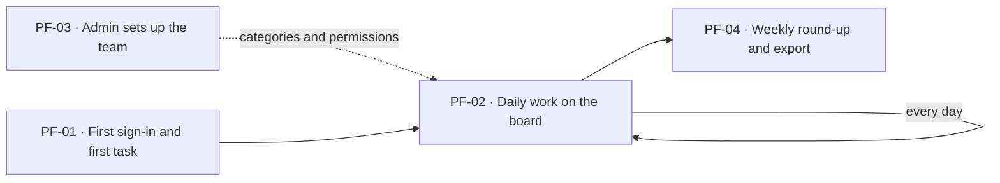
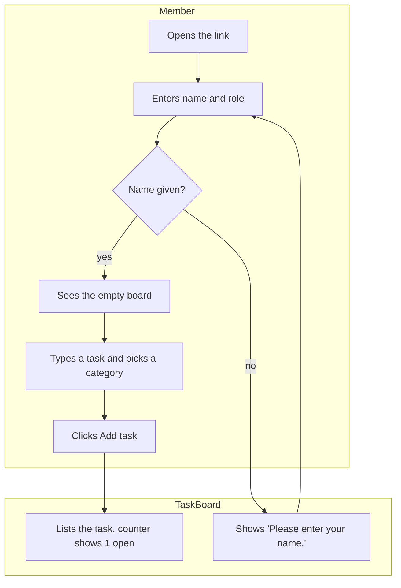
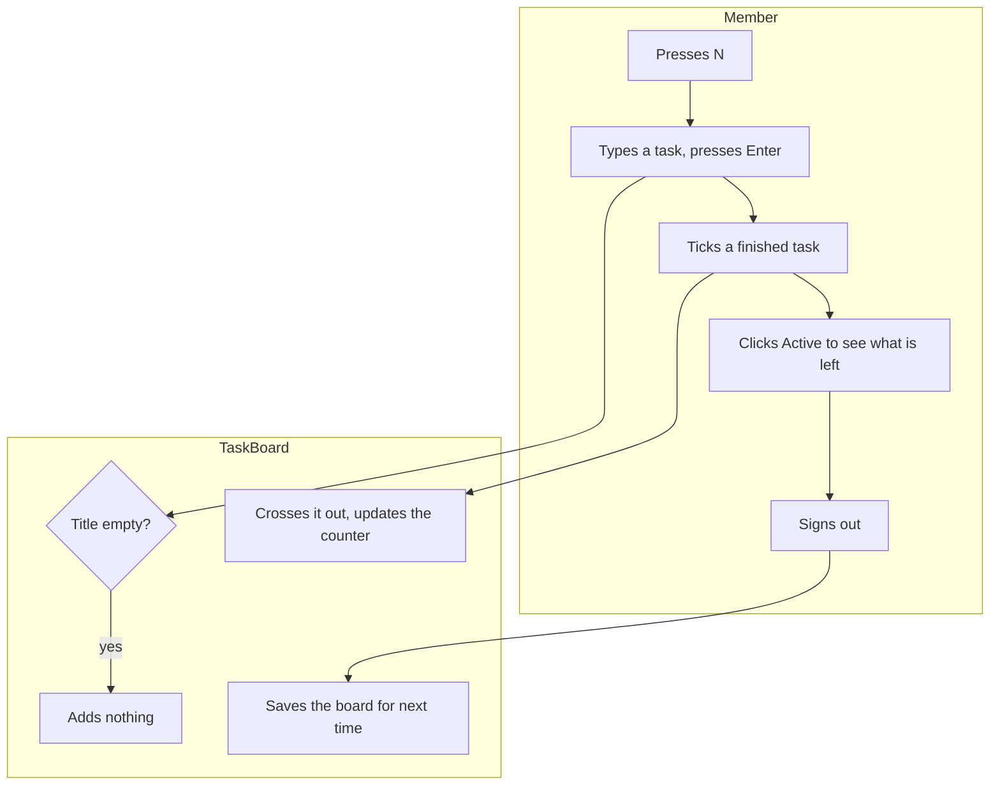
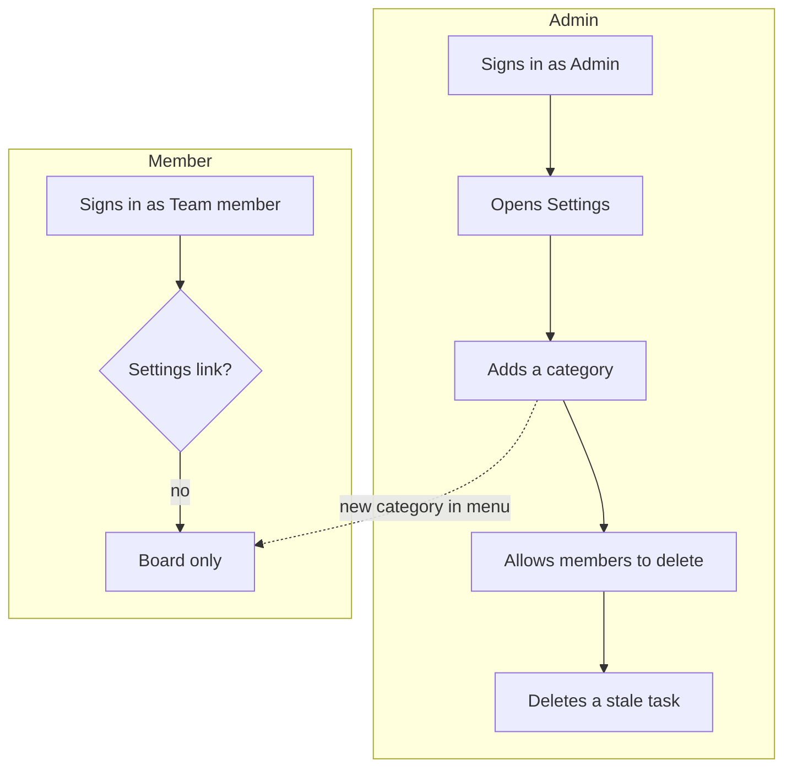
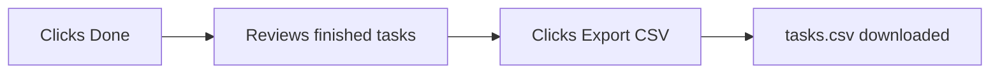

# Process Flows — TaskBoard

## PF-00 · Product lifecycle

- Entry flows: PF-01 (a new team member), PF-03 (the team admin)
- Core loop: PF-02, repeated daily

### PF-01 · First sign-in and first task

- Persona(s): Team member
- Trigger: a teammate shares the TaskBoard link
- Outcome: the member is on the board under their name and their first task is listed with "1 open · 0 done"
- Priority: Must
- Features: F-01, F-02
- Preceded by: none
- Followed by: PF-02

**Steps**

| Step | Actor | Action | System response | Use case | Feature | Data |
|---|---|---|---|---|---|---|
| PF-01.1 | Team member | Opens the TaskBoard link | Shows the sign-in page | UC-01 | F-01 | — |
| PF-01.2 | Team member | Enters a name, keeps the Team member role, clicks Sign in | Shows the empty board and the name in the top bar | UC-01 | F-01 | session user created |
| PF-01.3 | Team member | Types a task, picks a category, clicks Add task | Lists the task; counter shows "1 open · 0 done" | UC-02 | F-02 | task created |

**Exception paths**

| Path | At step | Condition | System response | Rejoins at |
|---|---|---|---|---|
| PF-01.E1 | PF-01.2 | The name is empty | Shows "Please enter your name." and stays on sign-in | PF-01.2 |

### PF-02 · Daily work on the board

- Persona(s): Team member
- Trigger: the member starts their working day
- Outcome: new work is captured, finished work is ticked off, and the board is saved when the member signs out
- Priority: Must
- Features: F-02, F-03, F-04, F-08
- Preceded by: PF-01, PF-03
- Followed by: PF-04

**Steps**

| Step | Actor | Action | System response | Use case | Feature | Data |
|---|---|---|---|---|---|---|
| PF-02.1 | Team member | Presses N on the board | Puts the cursor in the new-task box | UC-02 | F-02 | — |
| PF-02.2 | Team member | Types a task and presses Enter | Lists the task with the selected category | UC-02 | F-02 | task created |
| PF-02.3 | Team member | Ticks a finished task | Crosses it out; the counter moves one from open to done | UC-03 | F-03 | task.done = true |
| PF-02.4 | Team member | Clicks Active | Shows only open tasks | UC-04 | F-04 | — |
| PF-02.5 | Team member | Clicks Sign out, later signs in again | Shows sign-in; after signing in, every task is still there | UC-08 | F-08 | session cleared; tasks kept |

**Exception paths**

| Path | At step | Condition | System response | Rejoins at |
|---|---|---|---|---|
| PF-02.E1 | PF-02.2 | The title is empty or only spaces | Adds nothing; the counter does not change | PF-02.2 |

### PF-03 · Admin sets up the team

- Persona(s): Team admin
- Trigger: a new team starts using TaskBoard, or the way it works changes
- Outcome: the team's categories exist and the delete rule is set, so members' daily work (PF-02) uses them
- Priority: Must
- Features: F-01, F-06, F-07
- Preceded by: none
- Followed by: PF-02

**Steps**

| Step | Actor | Action | System response | Use case | Feature | Data |
|---|---|---|---|---|---|---|
| PF-03.1 | Team admin | Signs in with the Admin role | Shows the board with a Settings link | UC-01 | F-01 | session user (admin) |
| PF-03.2 | Team admin | Clicks Settings | Shows Categories and Permissions | UC-06 | F-06 | — |
| PF-03.3 | Team admin | Types a category name, clicks Add category | Lists the category; it appears in everyone's category menu | UC-06 | F-06 | category created |
| PF-03.4 | Team admin | Ticks "Team members can delete tasks" | Shows "Settings saved." | UC-07 | F-07 | setting changed |
| PF-03.5 | Team admin | Clicks Delete on a task | Removes the task from the board | UC-07 | F-07 | task deleted |

**Exception paths**

| Path | At step | Condition | System response | Rejoins at |
|---|---|---|---|---|
| PF-03.E1 | PF-03.1 | The person signed in as a Team member | No Settings link; the settings page is not shown | ends |

### PF-04 · Weekly round-up and export

- Persona(s): Team member
- Trigger: the weekly team meeting
- Outcome: the member has reviewed finished work and has tasks.csv to share
- Priority: Should
- Features: F-04, F-05
- Preceded by: PF-02
- Followed by: none

**Steps**

| Step | Actor | Action | System response | Use case | Feature | Data |
|---|---|---|---|---|---|---|
| PF-04.1 | Team member | Clicks Done | Shows only finished tasks | UC-04 | F-04 | — |
| PF-04.2 | Team member | Clicks Export CSV | Downloads tasks.csv with every task | UC-05 | F-05 | file exported |
