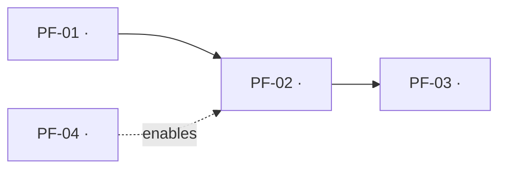
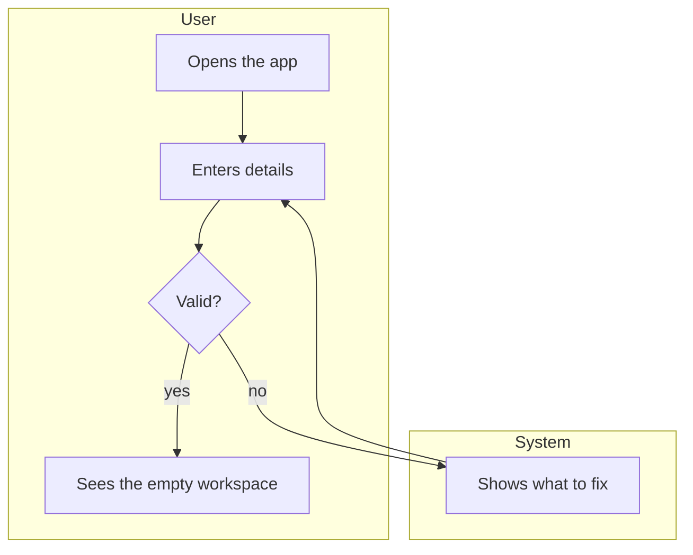
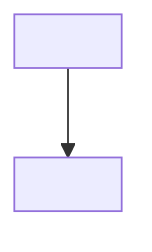

# Process Flows

<!-- Save as: docs/02d-process-flows.md · Written by: product-manager
End-to-end journeys: how a real person gets from a trigger to a finished
outcome, across every screen, role and system involved. This is the document
that keeps the product logically joined up — features and use cases describe
pieces; flows describe the whole path a user walks through them.

Format (validate_product_map.py parses it — keep the shapes exactly):
  - "## PF-00 · Product lifecycle": one Mermaid diagram that names EVERY flow
    id and shows how the flows connect (what a user does first, next, later).
  - one "### PF-xx · title" section per flow with the bullet lines below,
    a Mermaid diagram, a Steps table and an Exception paths table.
  - step ids are PF-xx.1, PF-xx.2, … in order; exception ids PF-xx.E1, …
  - every step names the use case (UC-xx) it belongs to and the feature (F-xx)
    that provides it; "—" only for a pure system step with no user action.
Rules the validator enforces:
  - every flow is reachable from an entry flow (Preceded by: none) through the
    Preceded by / Followed by links, and PF-00 mentions every flow
  - every use case appears in at least one flow step
  - every Must flow documents at least one exception path
  - every flow has a journey test case (Type: journey) in docs/02e-test-cases.md
    and every exception path has a test case
  - cross-role: when a feature changes what ANOTHER role can do (an admin
    setting, a permission, a list one role keeps for others — "Affects" in
    docs/02c-features.md), that role must have a step where it meets the
    effect: e.g. "PF-05.1 · Team member · opens the board after an admin
    allowed deleting · sees Delete". A switch also needs the OFF path as an
    exception ("PF-05.E1 · deleting is not allowed · no Delete button").
  - at the release gate a passing test must reach every step and exception
    path of every Must flow: the test calls flowStep('PF-xx.n') right after
    it has checked that step's System response.
Use Mermaid flowchart syntax. Put each role in its own subgraph when a flow
crosses roles (a handoff between people is where journeys usually break). -->

## PF-00 · Product lifecycle

- Entry flows: PF-01 (new user), PF-04 (admin)
- Cross-role: PF-04 changes what users can do in PF-02 (<which setting>)
- Core loop: PF-02, repeated daily

### PF-01 · <title: verb + object, e.g. "Sign up and create the first project">

- Persona(s): <persona>
- Trigger: <what makes the user start: an invite email, a need>
- Outcome: <the observable finished state, e.g. "a project exists with one task and the user sees it on the board">
- Priority: Must
- Features: F-01, F-02
- Preceded by: none
- Followed by: PF-02

**Steps**

| Step | Actor | Action | System response | Use case | Feature | Data |
|---|---|---|---|---|---|---|
| PF-01.1 | <persona> | <what the person does> | <what the system shows or changes> | UC-01 | F-01 | <entity created/read/changed, or —> |
| PF-01.2 | <persona> | <…> | <…> | UC-01 | F-01 | <…> |
| PF-01.3 | <persona> | <…> | <…> | UC-02 | F-02 | <…> |

**Exception paths**

| Path | At step | Condition | System response | Rejoins at |
|---|---|---|---|---|
| PF-01.E1 | PF-01.2 | <what goes wrong> | <exactly what the user sees> | PF-01.2 |

### PF-02 · <title>

- Persona(s): <persona>
- Trigger: <…>
- Outcome: <…>
- Priority: Must
- Features: F-02
- Preceded by: PF-01
- Followed by: none

**Steps**

| Step | Actor | Action | System response | Use case | Feature | Data |
|---|---|---|---|---|---|---|
| PF-02.1 | <persona> | <…> | <…> | UC-02 | F-02 | <…> |

**Exception paths**

| Path | At step | Condition | System response | Rejoins at |
|---|---|---|---|---|
| PF-02.E1 | PF-02.1 | <…> | <…> | <step id or "ends"> |
